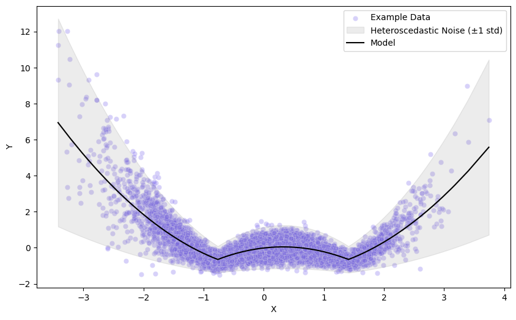
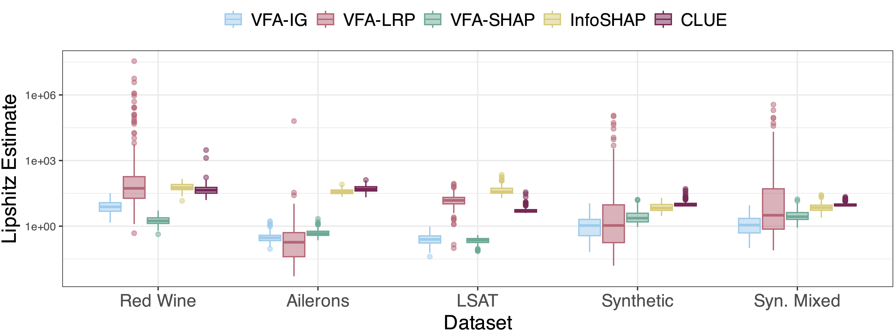
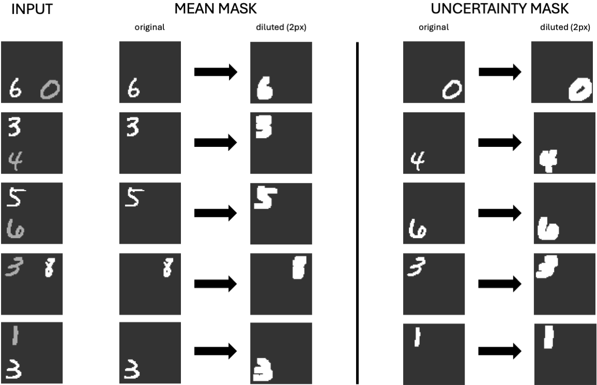
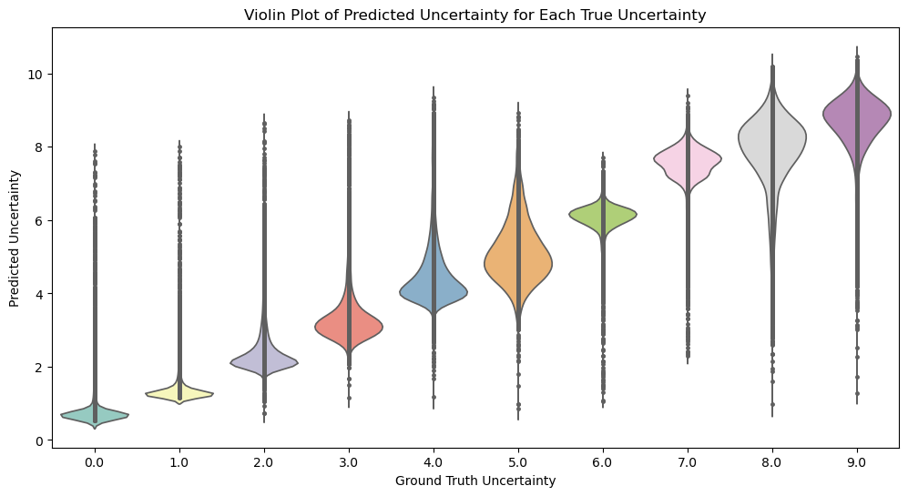
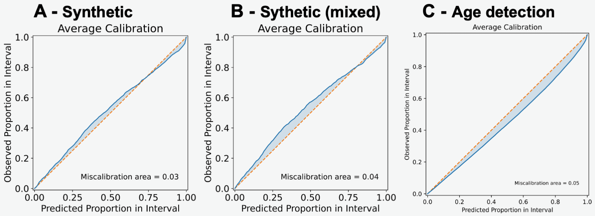
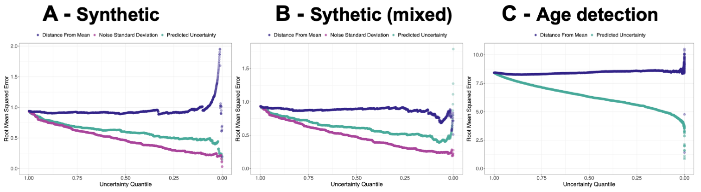
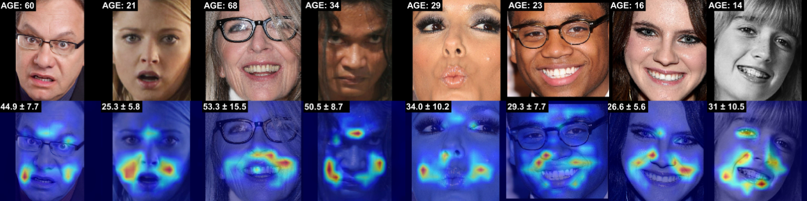

# Identifying Drivers of Predictive Aleatoric Uncertainty

Appendices, Supplements, and Code for IJCAI 2025 submission "Identifying Drivers of Predictive Aleatoric Uncertainty".

This README details how to reproduce the results from our manuscript **Identifying Drivers of Predictive Aleatory Uncertainty**. The README is divided into multiple sections shown in the [Table of Contents](#table-of-contents). 

# Table of Contents
* [1 Additional examples and verifications](#additional-examples-and-verifications) 
   * [1.1 Synthetic dataset with mixed mean and noise features](#11-synthetic-dataset-with-mixed-mean-and-noise-features)
   * [1.2 Global relevance and mass accuracy for the synthetic dataset with mixed mean and noise features](#12-global-relevance-and-mass-accuracy-for-the-synthetic-dataset-with-mixed-mean-and-noise-features)
   * [1.3 Localization, Robustness, Faithfulness](#13-localization-robustness-faithfulness)
   * [1.4 MNIST+U Dataset Experiment](#14-mnistu-dataset-experiment)
      * [1.4.1 MNIST+U Examples with Masks](#141-mnistu-examples-with-masks)
      * [1.4.2 MNIST+U Model Ground Truth vs Predicted Variance](#142-mnustu-model-ground-truth-vs-predicted-variance)
   * [1.5 Uncertainty Quality Analysis](#15-uncertainty-quality-analysis)
   * [1.6 Age detection example use case](#16-age-detection-example-use-case)
* [Licences](#licences)

# 1 Additional examples and verifications
### 1.1 Synthetic dataset with mixed mean and noise features
We initially separated noise and mean-influencing features in the synthetic data to enable unambiguous evaluations. However, in reality, we expect noise features to overlap with features influencing the mean. Specifically, we add five mixed features to the setup described in section 2.4 of the manuscript. These mixed features are generated using the same polynomial model as described, but they contribute to both the mean and the heteroscedastic noise. Thereby, the dataset comprises 80 features: 70 that exclusively influence the target's mean, five that exclusively affect the noise variance of the conditional target distribution, and five mixed features that impact both aspects.



*Figure 0: Example of a synthetic dataset with one feature that influences mean and uncertainty.*

## 1.2 Global relevance and mass accuracy for the synthetic dataset with mixed mean and noise features
We provide a command-line interface for running an synthetic uncertainty explanation experiments.
The script will train a heteroscedastic Gaussian neural network on the train data.
We subsequently explain the variance estimates on a test set using variance feature attribution (VFA flavors), infoshap, and Counterfactual Latent Uncertainty Explanations(CLUE). By default, we will run the explainers on 200 test instances with the highest predicted uncertainty "highU", highest predicted confidence "lowU", and random intances "randomU".
For CLUE we adapted code from https://github.com/cambridge-mlg/CLUE .
We use Python 3.11.5.

To run the global_synthetic_benchmark uncertainty explanation experiment, follow these steps (conda is required to install the environment):

1. Open a terminal or command prompt.

2. Install the requirements.txt file using `conda env create -f environment.yml`

3. Navigate to the directory `global_synthetic_benchmark`.

4. Use the following command to execute the script:

   ```bash
   python synthetic_uc_epl_experiment.py [options]
   ```

Options:

- `--n_instances_to_explain` (Default: 512): The number of instances to explain in the experiment.

- `--noise_scaler` (Default: 2.0): The noise scaler value used in the experiment. (In the paper this is alpha)

- `--n` (Default: 40000): The number of training instances (20% of these will be used for early stopping.)

- `--n_test` (Default: 1500): The number of data instances.

- `--remake_data`: An optional flag. If specified, it will resample data, if not it will look for an existing dataset with the parameters specified

- `--beta_gaussian`: An optional flag. If specified, beta gaussian loss will be used instead of vanilla gaussian NLL.


### Example Usage

```bash
python synthetic_uc_epl_experiment.py --n_instances_to_explain 256 --explainer_repeats 1 --noise_scaler 3.0 --n 30000 --n_test 2048 --remake_data
```

### Output

The script creates (directed and undirected) feature importances as results. The feature importances can be analyzed using
a) `shap_summaries.ipynb` for Figure 2 of the paper.
b) `plotting/plotting.R` for Figure 3 of the paper.


## 1.3 Localization, Robustness, Faithfulness
Go to the folder `metrics_benchmark`

1. Global Perturbation metrics (will run for all methods and datasets):
```bash
python run_perturbation_exp_global.py
```

2. Local Accuracy Metrics (will run for all methods and the specified datasets):
```bash
python run_localization_exp.py --dataset="<dataset>"
```
Dataset is a selection of `synthetic`, `red_wine`, `ailerons`, and `lsat`. `synthetic` is the default.

3. Local Lipschitz Continuity Metrics (will run for all methods and the specified datasets):
```bash
python run_robustness_lipschitz_exp.py --dataset="<dataset>"
```
Dataset is a selection of `synthetic`, `red_wine`, `ailerons`, and `lsat`. `synthetic` is the default.

### Example for Robustness
We extend our analysis of robustness to the synthetic dataset with mixed mean and noise features. Figure 2 shows that the results for this dataset reflect the observations for the other datasets. The Shapley-value-based methods VFA-SHAP and InfoSHAP, and VFA-IG seem more robust than CLUE and VFA-LRP. The methods' individual ranking differs between datasets, suggesting that the choice of the most robust method is subject to the dataset.



*Figure 2: Local Lipschitz continuity estimates for 200 test set instances for all methods and datasets. Lower values indicate higher robustness. VFA-SHAP, InfoSHAP, and VFA-IG are the most robust.*


## 1.4 MNIST+U Dataset Experiment
Go to the folder `mnist_plus_u`

1. To create the dataset follow the notebook `mnist_plus_create_data.ipynb`. Depending on the machine this can take a moment. **NOTE: This repository does not contain the full MNIST+U dataset. However, the generation of the dataset is seeded and the same dataset should be created every time the notebook is run.** 

2. To train the model used in the paper you can either exectute `mnist_plus_train_model_two_paths.py` or use the notebook `mnist_plus_train_model_two_paths.ipynb`. We provide the checkpoint we used in `/checkpoints_two_models`. There is also a version of the network where the convoluational layers are shared between the mean and variance outout. This model can be trained with `mnist_plus_train_model.ipynb` and a checkpoint is avaialble in `/checkpoints`.

3. To execute the evaluation using anymthod run one of the corresponding scripts with the following naming scheme: `mnist_plus_<method name>_double_path.py` such as
```bash
python mnist_plus_lrp_zennit_double_path.py
```

### 1.4.1 MNIST+U Examples with Masks
We show an example of what the images in the MNIST+U dataset look like. For each sample we also save a mean an variance mask used for evaluation. 



*Figure 3: MNIST+U samples and the ground truth masks we use to evaluate localization of the explainers. We dillute the pixels of the original MNIST pixels by two pixels to account for explanations that focus on the edges of the digits.*

### 1.4.2 MNIST+U Model Ground Truth vs Predicted Variance
We provide basic evaluation of the MNIST+U dataset in `mnist_plus_model_eval_double_path.ipynb`. We verify that the model's prediced uncertainty correlates with the ground truth uncertainty embedded in the images. 



*Figure 4: We evaluate the ability of the model to estimate the uncertainty. As expected, higher digits correspond to higher predicted variance.*


## 1.5 Uncertainty Quality Analysis
High-quality uncertainty estimates are essential for analyzing explanations of uncertainties. To evaluate the quality of the uncertainty estimates, we first examine the calibration of the uncertainty estimates using the [Uncertainty Toolbox](https://github.com/uncertainty-toolbox/). To assess calibration, $ \alpha$-prediction intervals are constructed which cover the observed values with a predicted probability of $\alpha\%$.  For varying $\alpha$, the calibration plot (Figure 5) shows the predicted proportion of test data within the interval versus the observed proportion of test targets covered by it ([Chung et. al., 2021](https://arxiv.org/abs/2109.10254)). We depict the calibration for the synthetic dataset (Figure 5 - A), the synthetic dataset with mixed uncertainty and mean features (Figure 5 - B), and for the age detection application (Figure 5 - C). Overall, the predicted uncertainties are well calibrated but slightly overconfident  for the synthetic datasets and marginally too conservative in the age detection task.



*Figure 5: Calibration plot for models trained on the synthetic and age detection datasets: predicted probability vs. observed proportions of instances covered by various probability intervals. The orange-colored angle bisector marks a perfectly calibrated hypothetical model.*

For meaningful uncertainty estimates, we also expect that we can reduce the prediction error by restricting the prediction to low-uncertainty instances. Therefore, as depicted in Figure 4, we determine the reduction in root mean squared error on a remaining test set when instances with the highest uncertainty are iteratively removed. We compare this to removal based on the distance of the prediction to the mean prediction as a baseline. For the synthetic datasets, we further depict the deduction in root mean squared error based on the highest ground truth noise standard deviation from the data generating process as the best attainable reduction. We find for the models trained on the synthetic data (Figure 4 - A), mixed synthetic data (Figure 4 - B), and the age detection task (Figure 4 - C) that the uncertainty-based filtering is effective. This indicates that the predicted uncertainty is a meaningful indicator of the expected prediction error. 



*Figure 6: Root mean squared error of the data for various uncertainty quantiles of the test set. From left to right, data points are removed based on predicted uncertainty (green), distance from the mean prediction (blue), or, for synthetic data, the ground truth noise standard deviation of the data-generating process (purple). For models trained on the synthetic and age detection datasets, lower uncertainty leads to reduced RMSE compared to the overall RMSE of the test set. This indicates that the uncertainty is a meaningful indicator of the expected prediction error.*

## 1.6 Age detection example use case
Age detection finds application in various areas, from security to retail. We apply MiVOLO ([Kuprashevich and Tolstykh, 2023](https://arxiv.org/abs/2307.04616)), a state-of-the-art vision transformer that achieves best-of-its-class performance in multiple benchmarks. It was designed to tackle age and gender detection simultaneously to leverage synergies. For simplicity, we use a version of the model that only uses face images as input and omits additional body images.
We use a pre-trained version of MiVOLO and, following our procedure introduced in the manuscrupt in Section 2.1, extend the parameter matrices of the MiVOLO head, auxiliary head, and their respective bias terms. We initialize them using a Gaussian distribution following [Glorot and Bengio [2010]](https://proceedings.mlr.press/v9/glorot10a/glorot10a.pdf) and a bias of zero. We fine-tune this model using the IMBD-clean dataset [Lin et. al., 2022](https://arxiv.org/abs/2106.11145), using the annotations and pre-processing by [Kuprashevich and Tolstykh [2023]](https://arxiv.org/abs/2307.04616). We use the GNLL and the Adam optimizer with a learning rate of $1e\text{-}5$, a weight decay of $1e\text{-}2$, and a batch size of 176, which optimizes GPU utilization on the employed hardware. To detect and visualize the drivers of uncertainty in the images, we use HiResCAM.

If not specified, all paths refer to files in the `age_detection` directory.

If you have not done so, please follow the following steps to set up the conda environment:
1. Open a terminal or command prompt.

2. Install the requirements.txt file using `conda env create -f environment.yml`

### Download the IMBD-clean dataset
Follow the instructions on the [IMBD-clean GitHub repository](https://github.com/yiminglin-ai/imdb-clean) to download the images. The downloaded images (in the numbered directories) need to be stored in a directory called images:
```bash
mivolo/data/dataset/images
```

Additionally, the [MiVOLO specific annotations](https://drive.google.com/file/d/17uEqyU3uQ5trWZ5vRJKzh41yeuDe5hyL/view?usp=sharing)  need to be downloaded. The CSV files for the train, validation, and test sets need to be stored at:
```bash
mivolo/data/dataset/annotations
```
We provide a separate example set, `imdb_example_new.csv`, that contains the example images used in our manuscript.

### Download a MiVOLO checkpoint and the YOLO checkpoint
Refer to the [MiVOLO GitHub](https://github.com/WildChlamydia/MiVOLO) to download an IMBD-clean checkpoint of choice and the [YOLO checkpoint](https://drive.google.com/file/d/1CGNCkZQNj5WkP3rLpENWAOgrBQkUWRdw/view) also provided by the authors of MiVOLO and store them at:
```bash
models/
```
**Note:** We provide the variance fine-tuned checkpoint used in the manuscript: `models/variance_feature_attribution_mivolo_checkpoint.pth.tar`.

**Note:** To use a downloaded checkpoint, you must extend it with a variance output!

### Expanding the model with a variance output
The `variance_output_injection.ipynb` notebook shows how to inject an additional weight vector into the head and auxiliary head and extend the bias.

### Fine-tuning the pre-trained model with Gaussian negative log-likelihood loss
To fine-tune the extended model, use `train_mivolo.py`. To run the training with the parameters from the manuscript, run the following:
```bash
python train_mivolo.py --name="example_run" --learning-rate=0.00001 --weight-decay=0.01 --epochs=50
```

#### Running the model on the test set 
To run the trained model on the test set, refer to the `test_mivolo.ipynb`. The default checkpoint selected in the notebook is the one we trained and used to produce the results in the manuscript.

To reproduce Figure 8 from the Appendix, run the data on the test set and then use `generate_data_for_uncertainty_evaluation.ipynb` to generate the necessary files used for the plot in `plotting/plotting.R`.

### Creating variance explanations
There are two options to create variance explanations:
#### Option 1: Use our example images notebook
To reproduce the explanations for the variance from our age detection example, refer to the `example_explanations.ipynb` notebook. Similar to the testing notebook, it has the checkpoint used to create the figures from the manuscript pre-selected. 
#### Option 2: Create explanations for the whole test set
If you want to create examples for the whole test set, use `create_explanations.py`. The configuration used in the manuscript is:
```bash
python create_explanations.py --checkpoint="variance_feature_attribution_mivolo_checkpoint" --method="hiresCAM"
```

### Calibration
The `age_detection/calibration` folder contains a notebook to recalibrate the uncertainties using std-scaling.

### Example
We showcase the application of VFA to age detection using MiVOLO and the IMDB-clean dataset. Applying VFA with HiResCAM reveals reasonable potential explanations for the predictive uncertainty (see Figure 7). The explanations mainly focus on areas around the eyes, mouth, nose, and forehead. These areas are highlighted especially strongly when the person in the image shows emotions that lead to distortions of these facial areas.



*Figure 7: Input images and uncertainty explanations in an age detection experiment using VFA with HiResCAM. Images are annotated with the ground truth and predicted mean and standard deviation.*


# Licences
We use code from different projects that we build on. In the following, we list the appropriate licenses for different sections of the code that we have used from other work.

#### MiVOLO
We use and adapt various code from [MiVOLO](https://github.com/WildChlamydia/MiVOLO) which is under [this licenses](/age_detection/mivolo_license/en_us.pdf). This involves code in the following files:
- `mivolo/predictor.py` and ``mivolo/predictor_orig.py``
- `mivolo/structures.py`
- All code in `mivolo/data/`
- `mivolo/model/create_timm_model.py`
- `mivolo/model/cross_bottleneck_attn.py`
- `mivolo/model/mi_volo.py` and `mivolo/model/mi_volo_orig.py`
- `mivolo/model/mivolo_model.py`
- `mivolo/model/yolo_detector.py`


#### hugging face PyTorch Image Models timm VOLO
We use and adapt the code in `mivolo/model/volo.py` from [huggingface PyTorch Image Models](https://github.com/huggingface/pytorch-image-models), which is under the [Apache 2.0 license](/age_detection/pytorch_image_models_licence/LICENSE.txt).

#### Transformer-Explanations
We use and adapt the code in `mivolo/model/explanation_generator.py` from [Transformer-Explanations](https://github.com/hila-chefer/Transformer-Explainability), which is under this [MIT Licence](/age_detection/transformer_explainability_licence/LICENSE.txt).

#### Original implementaiton of Lipschitz metric
We use and adapt code in `metrics_benchmark/lipschitz_metric.py` from [Robustness-of-Interpretability-Methods](https://github.com/viggotw/Robustness-of-Interpretability-Methods), which is under this [MIT Licence](metrics_benchmark/Robustness-of-Interpretability-Methods_licence/LICENSE.txt).

#### CLUE

We apadt code in `synthetic_experiments/CLUE` and in the `/synthetic_experiments/synthetic_experiment_utils.py` `explain_clue()` function from [CLUE](https://github.com/cambridge-mlg/CLUE), which is under this [MIT Licence](/synthetic_experiments/CLUE_LICENSE.txt).


